<p align="center">
  
</p>

CTO at **Trillium Technologies**, leading **Phibase**: a Kubernetes-based
SaaS handling millions of API calls a month for manufacturing, retail and F&B leaders across
Indonesia and Singapore. Off the clock, I build AI systems in a private lab and open-source
the pieces that are useful on their own.

<p>
  
  
  
  
  
  
  
  
  
  
</p>

> [!TIP]
> **🔒 Most of my work lives in private repos.** It's product and domain code I can't publish, so below you'll find what it *does*. Happy to walk through any of it on a call.

<p align="center">
  
</p>

<p align="center">
  <a href="https://github.com/ronimoe/my-whisper"></a>
  <a href="https://github.com/ronimoe/ai-software-studio"></a>
</p>
<p align="center">
  <a href="https://github.com/ronimoe/github-agent"></a>
  
</p>

<p align="center">
  
</p>


Tooling for running AI agents like a team, not a toy.

<p align="center">
  <a href="https://github.com/ronimoe/ai-software-studio">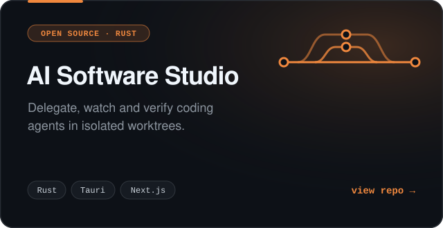</a>
  <a href="https://github.com/ronimoe/github-agent">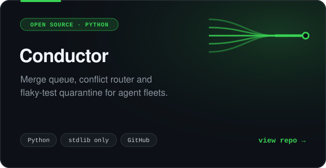</a>
</p>
<p align="center">
  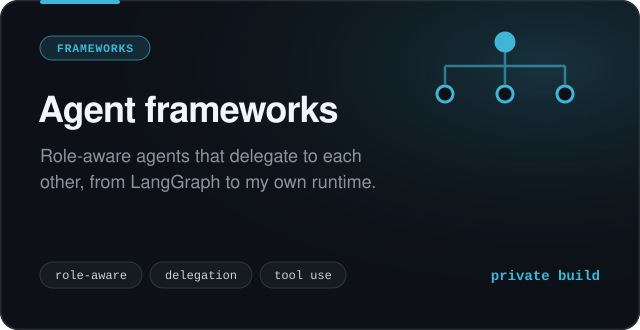
  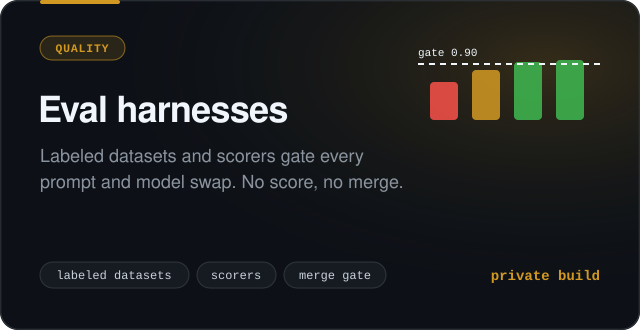
</p>


Built around real workflows: the paper forms, the field reps, the front desk.

<p align="center">
  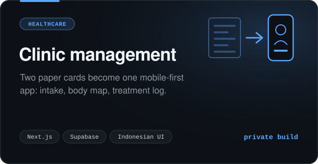
  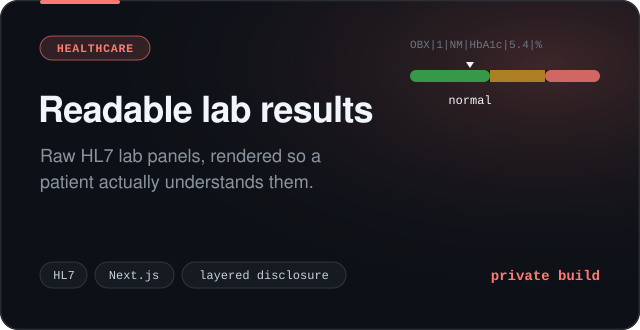
</p>
<p align="center">
  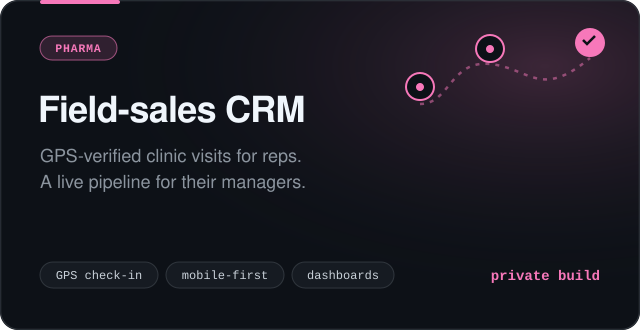
  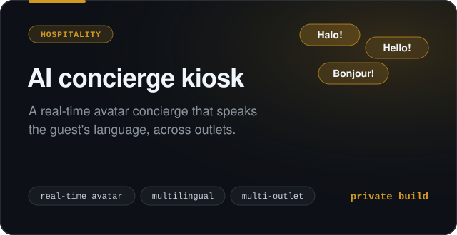
</p>
<p align="center">
  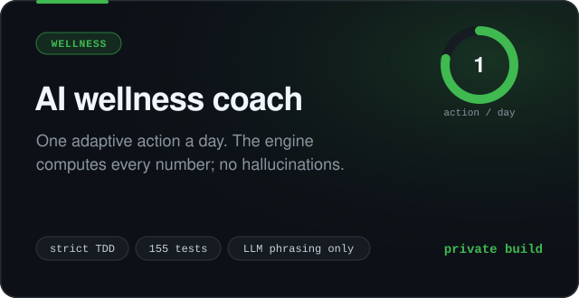
  <a href="https://www.linkedin.com/in/rmulyana">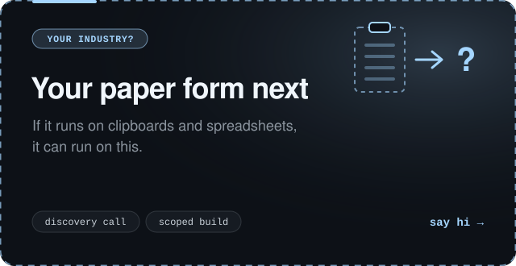</a>
</p>


Side experiments that got serious.

<p align="center">
  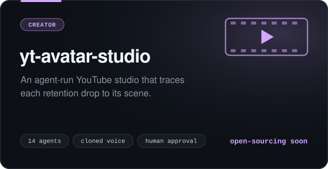
  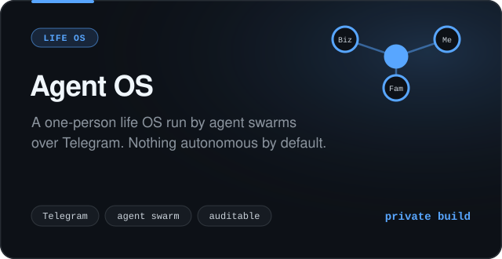
</p>
<p align="center">
  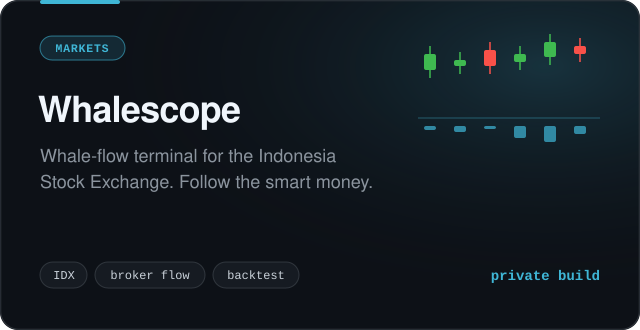
  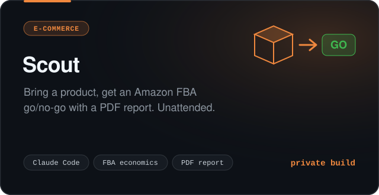
</p>
<p align="center">
  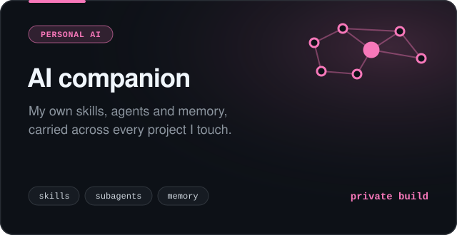
  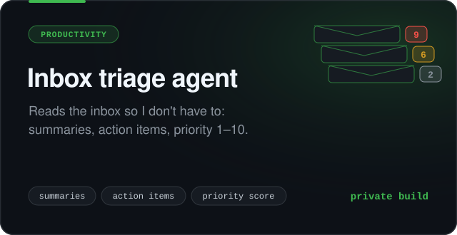
</p>

<p align="center">
  
</p>

```diff
@@ the usual way  →  my way @@
- tweak the prompt, eyeball a few outputs, ship
+ every prompt is hashed. Change one without re-running its eval and the build goes red

- "the eval passed"
+ caught an agent scoring 100% by saying nothing at all. Now every check demands real output first

- ask the model nicely not to touch the price
+ the price is pinned in code. When the prompt already says it, the next fix is a guard, not a sentence

- the smartest model for everything
+ a mid model on high effort writes the code. The top model only makes the calls a spec can't

- let the AI run on its own from day one
+ every human approve/reject becomes labeled data. Autonomy is earned one eval score at a time

- output breaks, blame the architecture
+ swap the model first. One replied in Chinese on 6% of calls: measured, then fired
```

<p align="center">
  
</p>

```console
$ git log --oneline career
2020..now   feat: CTO. A Kubernetes SaaS serving millions of API calls a month
2017..2020  feat: tech lead on ERP, IoT pipelines & AI platforms for enterprises
2015..2017  feat: co-founded a digital studio (IoT, full-stack, inbound)
2013..2014  feat: R&D director at a mobile-marketing startup (+45% acquisition)
2010..2014  feat: founded a web agency. SEO, content, 2-4x traffic for clients
2002..2010  init: telecom rollouts across Java, Sumatra & Kalimantan
```

> Twenty-plus years, one rule: *complex tech is only worth it when it pays for itself.*

<p align="center">
  
</p>

<p align="center">
  
</p>

<p align="center">
  <picture>
    <source media="(prefers-color-scheme: dark)" srcset="https://streak-stats.demolab.com?user=ronimoe&theme=github-dark-blue&hide_border=true&background=0D1117" />
    
  </picture>
</p>

<p align="center">
  <picture>
    <source media="(prefers-color-scheme: dark)" srcset="https://raw.githubusercontent.com/ronimoe/ronimoe/output/snake-dark.svg" />
    
  </picture>
</p>

<p align="center">
  
</p>

<p align="center">
  <a href="https://www.linkedin.com/in/rmulyana"></a>
</p>
