<p align="center">
  
</p>

CTO at **Trillium Technologies**, leading **Phibase**: a Kubernetes-based
SaaS handling millions of API calls a month for manufacturing, retail and F&B leaders across
Indonesia and Singapore. Off the clock, I build AI systems in a private lab and open-source
the pieces that are useful on their own.


> [!TIP]
> **🔒 Most of my work lives in private repos.** It's product and domain code I can't publish, so below you'll find what it *does*. Happy to walk through any of it on a call.

<p align="center">
  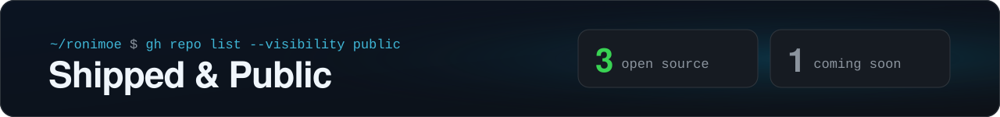
</p>

<p align="center">
  <a href="https://github.com/ronimoe/my-whisper">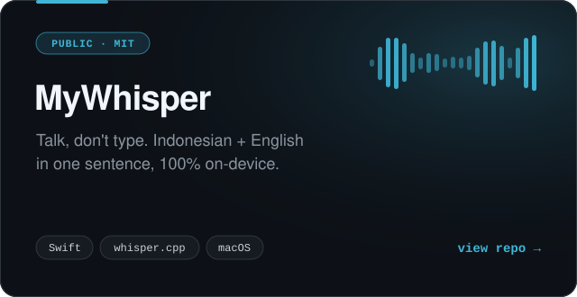</a>
  <a href="https://github.com/ronimoe/ai-software-studio">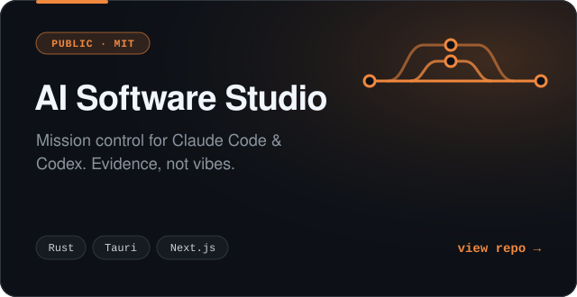</a>
</p>
<p align="center">
  <a href="https://github.com/ronimoe/github-agent">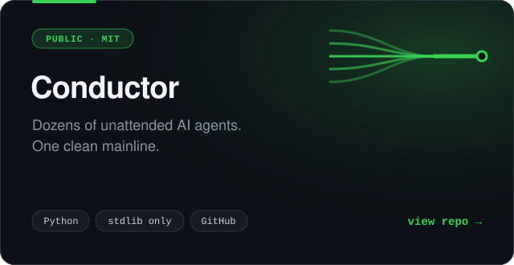</a>
  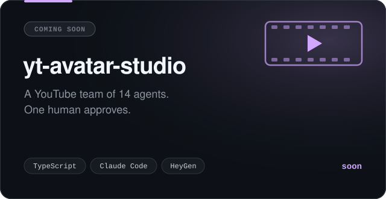
</p>

<p align="center">
  
</p>

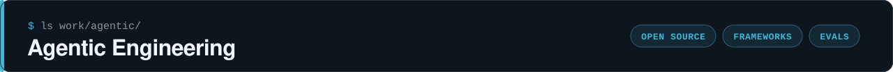

Tooling for running AI agents like a team, not a toy.

<table>
<tr>
<td width="50%" valign="top">
<h3>🛠️</h3>
<sub><code>OPEN SOURCE · RUST</code></sub><br />
<a href="https://github.com/ronimoe/ai-software-studio"><b>AI Software Studio</b></a><br />
<sub>Tauri + Rust desktop app to delegate, watch and verify coding agents.</sub>
</td>
<td width="50%" valign="top">
<h3>🚦</h3>
<sub><code>OPEN SOURCE · PYTHON</code></sub><br />
<a href="https://github.com/ronimoe/github-agent"><b>Conductor</b></a><br />
<sub>Merge queue, conflict router and flaky-test quarantine for agent fleets. Zero dependencies.</sub>
</td>
</tr>
<tr>
<td width="50%" valign="top">
<h3>🧩</h3>
<sub><code>FRAMEWORKS</code></sub><br />
<b>Agent frameworks</b> 🔒<br />
<sub>Role-aware agents that delegate to each other, from early LangGraph experiments to my own runtime.</sub>
</td>
<td width="50%" valign="top">
<h3>📏</h3>
<sub><code>QUALITY</code></sub><br />
<b>Eval harnesses</b> 🔒<br />
<sub>Labeled datasets and scorers that gate every prompt and model swap. No score, no merge.</sub>
</td>
</tr>
</table>

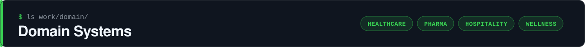

Built around real workflows: the paper forms, the field reps, the front desk.

<table>
<tr>
<td width="33%" valign="top">
<h3>🦴</h3>
<sub><code>HEALTHCARE</code></sub><br />
<b>Clinic management</b> 🔒<br />
<sub>Two paper cards → one mobile-first app. Intake, freehand body map, treatment log, owner reports.</sub>
</td>
<td width="33%" valign="top">
<h3>🧪</h3>
<sub><code>HEALTHCARE</code></sub><br />
<b>Readable lab results</b> 🔒<br />
<sub>Raw HL7 lab panels, rendered so a patient actually understands them.</sub>
</td>
<td width="33%" valign="top">
<h3>💊</h3>
<sub><code>PHARMA</code></sub><br />
<b>Field-sales CRM</b> 🔒<br />
<sub>GPS-verified clinic visits for reps. A live pipeline for their managers.</sub>
</td>
</tr>
<tr>
<td width="33%" valign="top">
<h3>🛎️</h3>
<sub><code>HOSPITALITY</code></sub><br />
<b>AI concierge kiosk</b> 🔒<br />
<sub>A real-time avatar concierge that speaks the guest's language, across multiple outlets.</sub>
</td>
<td width="33%" valign="top">
<h3>🌿</h3>
<sub><code>WELLNESS</code></sub><br />
<b>AI wellness coach</b> 🔒<br />
<sub>One adaptive action a day. The engine computes every number, so the coach can't hallucinate one.</sub>
</td>
<td width="33%" valign="top">
<h3>📋</h3>
<sub><code>YOUR INDUSTRY?</code></sub><br />
<b>Your paper form next</b><br />
<sub>If it runs on clipboards and spreadsheets, it can run on this. <a href="https://www.linkedin.com/in/rmulyana">Say hi →</a></sub>
</td>
</tr>
</table>

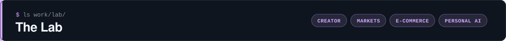

Side experiments that got serious.

<table>
<tr>
<td width="33%" valign="top">
<h3>🎬</h3>
<sub><code>CREATOR</code></sub><br />
<b>yt-avatar-studio</b> 🔒<br />
<sub>A YouTube studio run by agents, with a learning loop that traces each retention drop to the scene that caused it.</sub>
</td>
<td width="33%" valign="top">
<h3>🏠</h3>
<sub><code>LIFE OS</code></sub><br />
<b>Agent OS</b> 🔒<br />
<sub>A one-person life OS run by a swarm of agents over Telegram. Fully auditable; nothing runs on its own until I say so.</sub>
</td>
<td width="33%" valign="top">
<h3>🐋</h3>
<sub><code>MARKETS</code></sub><br />
<b>Whalescope</b> 🔒<br />
<sub>Whale-flow terminal for the Indonesia Stock Exchange. Follows the smart money broker by broker, with a cost-aware backtest.</sub>
</td>
</tr>
<tr>
<td width="33%" valign="top">
<h3>📦</h3>
<sub><code>E-COMMERCE</code></sub><br />
<b>Scout</b> 🔒<br />
<sub>Bring a product, get an Amazon FBA go/no-go: competitor benchmarks, FBA economics and a PDF report. Fully unattended.</sub>
</td>
<td width="33%" valign="top">
<h3>🧠</h3>
<sub><code>PERSONAL AI</code></sub><br />
<b>AI companion</b> 🔒<br />
<sub>My own skills, agents and memory, carried across every project I touch.</sub>
</td>
<td width="33%" valign="top">
<h3>📬</h3>
<sub><code>PRODUCTIVITY</code></sub><br />
<b>Inbox triage agent</b> 🔒<br />
<sub>Reads the inbox so I don't have to: summaries, action items, priority scores.</sub>
</td>
</tr>
</table>

<p align="center">
  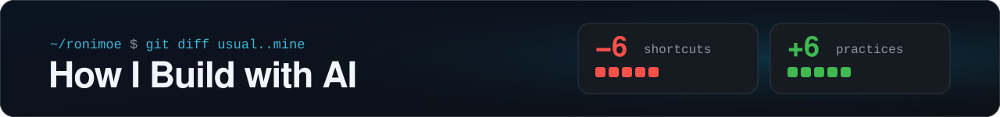
</p>

```diff
@@ the usual way  →  my way @@
- tweak the prompt, eyeball a few outputs, ship
+ every prompt is hashed. Change one without re-running its eval and the build goes red

- "the eval passed"
+ caught an agent scoring 100% by saying nothing at all. Now every check demands real output first

- ask the model nicely not to touch the price
+ the price is pinned in code. When the prompt already says it, the next fix is a guard, not a sentence

- the smartest model for everything
+ a mid model on high effort writes the code. The top model only makes the calls a spec can't

- let the AI run on its own from day one
+ every human approve/reject becomes labeled data. Autonomy is earned one eval score at a time

- output breaks, blame the architecture
+ swap the model first. One replied in Chinese on 6% of calls: measured, then fired
```

<p align="center">
  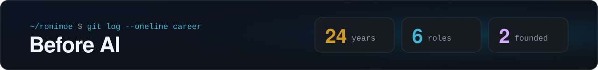
</p>

```console
$ git log --oneline career
2020..now   feat: CTO. A Kubernetes SaaS serving millions of API calls a month
2017..2020  feat: tech lead on ERP, IoT pipelines & AI platforms for enterprises
2015..2017  feat: co-founded a digital studio (IoT, full-stack, inbound)
2013..2014  feat: R&D director at a mobile-marketing startup (+45% acquisition)
2010..2014  feat: founded a web agency. SEO, content, 2-4x traffic for clients
2002..2010  init: telecom rollouts across Java, Sumatra & Kalimantan
```

> Twenty-plus years, one rule: *complex tech is only worth it when it pays for itself.*

<p align="center">
  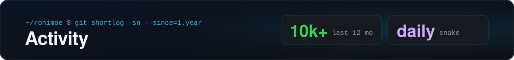
</p>

<p align="center">
  
</p>

<p align="center">
  <picture>
    <source media="(prefers-color-scheme: dark)" srcset="https://streak-stats.demolab.com?user=ronimoe&theme=github-dark-blue&hide_border=true&background=0D1117" />
    
  </picture>
</p>

<p align="center">
  <picture>
    <source media="(prefers-color-scheme: dark)" srcset="https://raw.githubusercontent.com/ronimoe/ronimoe/output/snake-dark.svg" />
    
  </picture>
</p>

<p align="center">
  
</p>

<p align="center">
  <a href="https://www.linkedin.com/in/rmulyana"></a>
</p>
